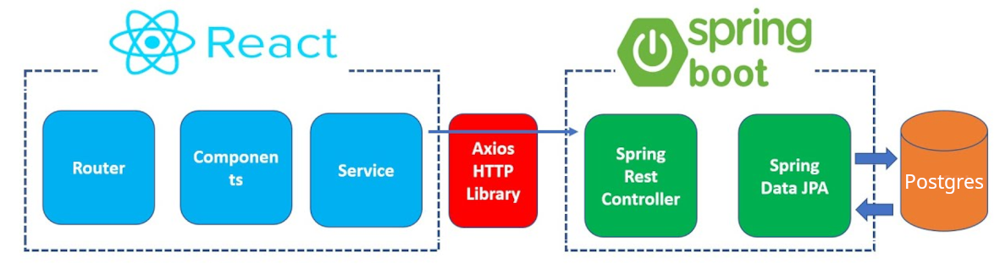
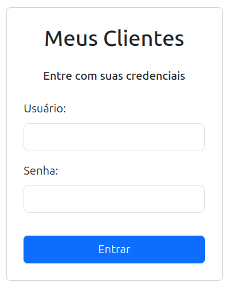
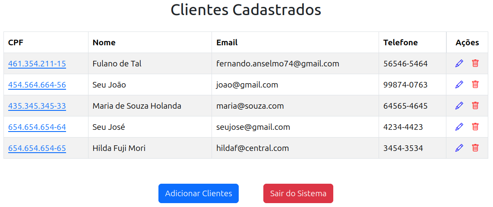
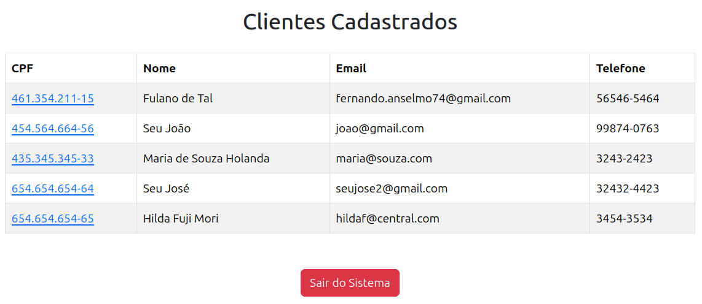

# Projeto Meus Clientes: Front-End
Este é um projeto que exemplifica como trabalhar com "React + Spring Boot". A arquitetura deste foi montada conforme o seguinte esquema:



Ativar o Back acessar a aplicação em:
http://localhost:3000

Mais Detalhes do Back: https://github.com/fernandoans/meusclientes-back

## Ferramentas Utilizadas
Para esta parte foram utilizadas as seguintes tecnologias:
* Java - versão 21
* Sprint Tool Suite 4
* Spring Boot - versão 3.3.5
* SpringDoc - versão 2.1.0
* Lombok - versão 1.18.34
* Chamada ao serviço de CEP da viacep.com.br com o WebFlux
* Banco Postgres (detalhes abaixo)

Para a parte do front-end (MeusClientesFront) foram utilizadas as seguintes tecnologias:
* React.js 18.3.1
* Node.js 18.20.4
* npm 18.3.1
* Bootstrap 5.3.3
* Axios 1.7.7

## Compilar
Este projeto utiliza o Node e NPM para o gerenciamento dos pacotes, para iniciar o projeto:
`npm start

Uma vez ativado, o navegador será chamado e redirecionado para a porta 3000, tenha certeza que o back já está ativo e respondendo corretamente, e a seguinte tela será mostrada:



Existem dois usuários:

```
Usuário: admin
Senha: 123qwe!@#
```

Que possui permissão de acesso total ao sistema, podendo Visualizar, Incluir, Alterar e Excluir Clientes. o outro usuário é:

```
Usuário: padrão
Senha: 123qwe123
```

Que pode apenas Visualizar os dados.

## Detalhes do Projeto
O primeiro serviço que deve ser chamado no momento do login é:
`http://localhost:8080/meusclientes/login/

Este retornará um TOKEN válido que será guardado na seção para acesso aos serviços do cliente. Uma vez recebido e decodificado esse Token outras informações serão obtidas e entre elas o modo de acesso. Para o usuário "admin" a tela mostrada será:



e para o usuário padrão:


